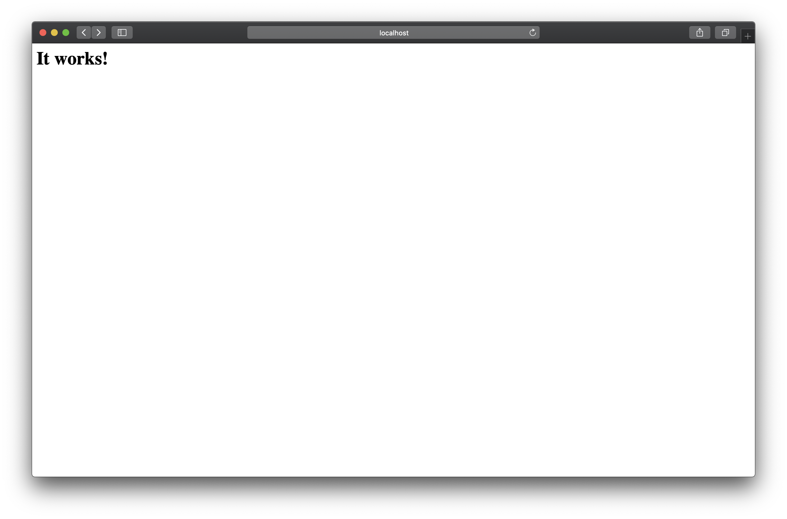
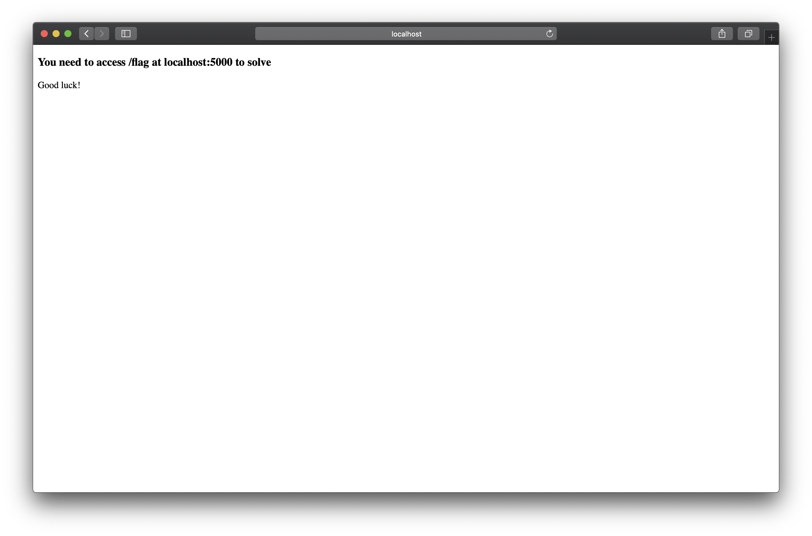

#   Websocket - HTTP Smuggling
##	Composition

1.Varnish

2.Flask

```
                        +---[9020]---+
                        | 9020->80   |
                        |   Varnish  |
                        |            |
                        +---+---+----+
               [apache.net] |   | [flask.net]
                    +-------+   +-------+
                    |                   |
              +---[80]-----+     +---[5000]---+
              |  Apahce    |     |    Flask   |
              |            |     |            |
              |            |     |            |
              +-----+------+     +----+-------+
```


##	Usage

Only for POC.

###	build

```bash
docker-compose up
```

The varnish server will on the port 9020.


###	check

Visit http://localhost:9020/, you will see this:



It means OK!

Visit http://localhost:9020/websocket.html, you will see a websocket example.



Your goal is to get the flag on the internal network flask.net. The url is /flag. Obviously you can't access the /flag from the outer network.


###	reproduce

There is something different from the original online environment. You need to add the filed name `Connection`.

It seems like the varnish config file is important. But the author doesn't disclosure the file.

The exp is in the exp/exp.py. And you need python2.


#	Reference

https://github.com/0ang3el/websocket-smuggle